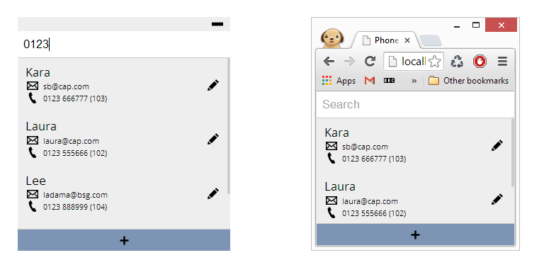

Web and Desktop Phone List
==================

An application that demonstrates the ability to share javascript code between the browser and native desktop applications.

The desktop application can be run using [node-webkit](https://github.com/rogerwang/node-webkit) and has been tested on windows using version v0.10.1.

The web version is a fairly vanilla angular application and can be hosted on any web server. It has been tested using Chrome.

Building
==================
[Gulp](https://www.npmjs.org/package/gulp) is used to build the project. Navigating to the root of the repository and running the `npm-install` and `gulp` commands will build the web and desktop versions of the project and output them to the 'dist' folder.
